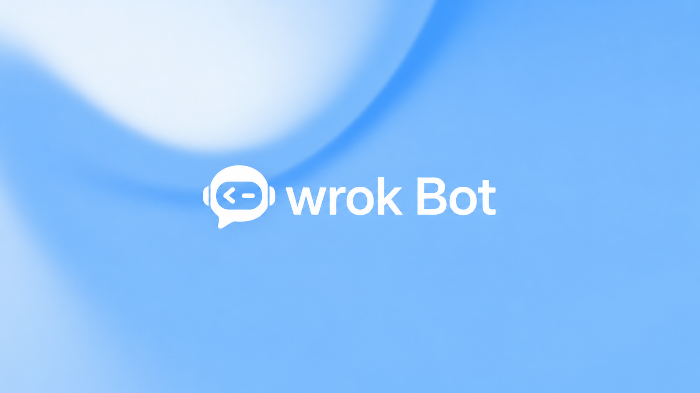

<p align="center">
  
</p>

<h1 align="center">Wrok Bot</h1>

<p align="center"><strong>English</strong> | <a href="README.zh-CN.md">简体中文</a></p>

<p align="center">AI workbench · Agent collaboration · Browser and computer interaction</p>

Wrok Bot is an AI workbench built with Rust, with a desktop host, server, web interface, and a mobile client under development. The project is currently in development and validation, with macOS as the first release platform.

## Current progress

Status as of October 2, 2026, based on the current source and local validation. Passing individual checks does not mean the installer or the complete product has passed release validation.

| Module | Current status | Remaining work for the first release |
| --- | --- | --- |
| Workbench and UI | Branding, channels, coworkers, skills, memory, and administration screens are implemented; UI unit tests and web builds have been validated | Complete workflow, keyboard, and accessibility validation in actual macOS windows |
| Local services and data | Local services, PostgreSQL, sessions, and persistence have passed individual checks | Clean installation, credential access, reliable startup and shutdown, upgrades, and recovery validation |
| Model connections | Custom connection management and shared inference are implemented; gateway transport awaits integration validation | End-to-end model selection, live conversations, tools, cancellation, and recovery across the gateway, account bridge, and custom model connections |
| System confirmation and authorization | The local confirmation state machine, window lifecycle handling, and related tests are implemented | Native authentication, cancellation, screen locking, and sleep validation in a properly signed app |
| Browser and computer interaction | Engine, screen transport, control permissions, and input have individual implementations | End-to-end validation of real operations, manual takeover, stopping, and failure recovery within the product |
| Mobile client | Shared page source and local web previews are available, with iOS/Android resource compilation records | Real accounts, device binding, native installation, and testing on physical devices for each platform; outside the macOS first-release scope |

## Release readiness

**Current delivery target: the first macOS release; release validation remains incomplete.** The earlier September estimate is not a verified delivery commitment. A new date will require evidence from the remaining product workflows and signed installer validation.

The first release aims to provide an installable macOS product covering three core workflows: the workbench and AI tools, browser interaction with manual takeover, and native computer interaction with stopping controls. Model connections, credential protection, data recovery, installation, and startup must also be validated.

The first release is not yet complete. Release validation still requires a signed installer, live model services, and testing on physical Macs. Apple Silicon and Intel support will be stated according to actual validation results. Windows, Linux, and mobile platforms will be validated separately, with progress published as work advances.

## Source layout

- `crates/`: domain, application, infrastructure, desktop, server, UI, and test tools.
- `apps/wrok-bot-mobile/`: mobile client source.
- `examples/`: sample application configuration.
- `fixtures/`: deterministic test data and asset contracts.
- `tools/`: dependency checks and build tool version configuration.

The Rust toolchain is pinned in `rust-toolchain.toml`, and Rust dependencies are locked in `Cargo.lock`. Native library requirements vary by platform. The CI workflow records Linux build dependencies, while `.cargo/config.toml` configures macOS library search paths.

## Server transport

The server listens on `127.0.0.1`. Local single-user operation uses `--local`. Remote deployments require a TLS reverse proxy on the same machine, an HTTPS `WROK_BOT_PUBLIC_URL`, and `WROK_BOT_TLS_PROXY_SECRET` containing 64 lowercase hexadecimal characters. The original `OPENBOT_*` variable names remain supported.

The proxy must discard incoming `x-wrok-bot-proxy-secret`, `x-forwarded-proto`, and `x-forwarded-host` values, then set exactly one of each: the shared secret, `https`, and the exact authority from the public URL (including an explicitly configured port). Forward only requests that arrived over HTTPS. Keep the secret private to the proxy and backend; never put it in browser code or client requests. A public URL alone does not authorize a request. Unverified requests receive only health diagnostics, with readiness returning 503; authentication and business routes remain unavailable. The server does not provide a direct TLS listener.

### MCP credential revocation recovery

Disconnecting an MCP connection invalidates its local credentials first. Vendor revocation may still be pending; keep the retained revocation record so the service can retry with the original server and credential context. An `operator_required` result requires revoking the credential in the vendor's own administration interface and checking the outcome there before reconnecting. Do not delete revocation records, recreate a same-name server to replace their identity, or restore old credentials to make an error disappear.

A pending or unknown OAuth refresh operation also blocks reuse of that credential. It is not cleared by a timeout or a configuration rollback. Reconnect explicitly to obtain a new credential; the old operation remains available for reconciliation. If the vendor may still accept the old credential, revoke it there as well. A successful local disconnect or reconnect does not prove that vendor revocation completed.

## Local checks

```sh
cargo fmt --all -- --check
cargo test -p openbot-testkit --features xtask --bin xtask
cargo xtask parity-check --fixtures-only
cargo xtask recount --fixtures-only
cargo xtask i18n-check
cargo xtask design-lint
```

The two `--fixtures-only` checks validate the public fixture manifest and its six declared queries. Recount uses the pinned Rust YAML parser for those exact queries; it does not require Python or PyYAML. They do not validate migration parity, overlay closure, or product readiness. Omitting `--fixtures-only` requires all nine migration ledgers, the overlay and fixture manifest, and fails when any required input is absent. Full recount can also require the fixed upstream checkout with `--require-upstream`.

Before committing, install the local publication checks. Python 3 and Gitleaks are required:

```sh
python3 tools/repository_guard.py install
```

The guard checks staged content before commits and the complete history being published before pushes. GitHub Actions remains manually triggered.

## License and acknowledgements

First-party code is free for personal use. Enterprise use requires authorization; see [LICENSE](LICENSE) for the terms.

Product and technical planning draws on grok bot and open bot, together with the open-source project crabcode-tui. See [NOTICE](NOTICE) for third-party acknowledgements. Third-party code, fonts, icons, and other assets retain their respective licenses.
