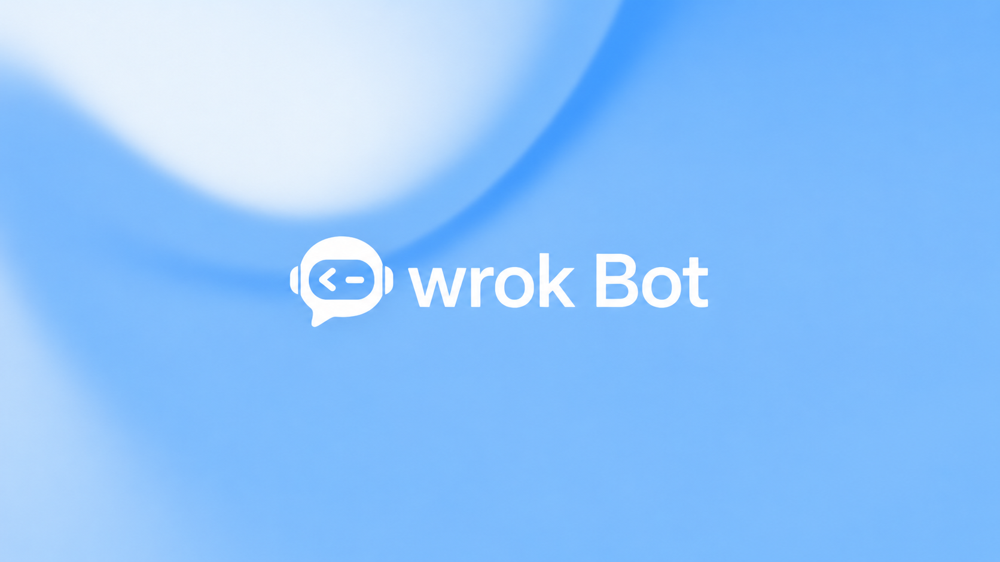

<p align="center">
  
</p>

<h1 align="center">Wrok Bot</h1>

<p align="center"><a href="README.md">English</a> | <strong>简体中文</strong></p>

<p align="center">AI 工作台 · 智能体协作 · 浏览器与电脑操作</p>

Wrok Bot 是使用 Rust 构建的 AI 工作台，包含桌面宿主、服务端、Web 界面和开发中的移动客户端。项目目前处于开发验证阶段，首版优先面向 macOS。

## 当前进度

状态更新：2026-09-07。以下依据截至该日的开发与验收记录；分项测试通过不代表安装包或完整产品已经验收。

| 模块 | 当前情况 | 首版仍需完成 |
| --- | --- | --- |
| 工作台与界面 | 品牌、频道、同事、技能、记忆及管理界面已有实现；已有 UI 单测和 Web 构建验证 | macOS 实际窗口的完整操作、键盘与可访问性验收 |
| 本机服务与数据 | 本地服务、PostgreSQL、会话与数据持久化已有分项验证 | 干净安装、凭据访问、稳定启动退出、升级与恢复验证 |
| 模型接入 | 自定义连接管理及共享推理已有实现；网关传输代码待组合验收 | 网关、账户桥接、自定义模型的选择、真实对话、工具、取消和恢复闭环 |
| 系统确认与授权 | 本机确认状态机、窗口生命周期及相关测试已有实现 | 正式签名 App 上的原生认证、取消、锁屏和睡眠验证 |
| 浏览器与电脑操作 | Engine、画面传输、控制权限与输入已有分项实现 | 产品内真实操作、人工接管、停止和故障恢复的完整验证 |
| 移动客户端 | 共享页面源码和本地 Web 预览可用，已有 iOS/Android 资源编译记录 | 真实账户、设备绑定、原生安装及各平台真机验收；不计入 macOS 首版完成范围 |

## 预计完成情况

**当前交付目标：macOS 首版，预计 2–4 周完成。**

以 2026-09-07 为起点，目标窗口为 **2026-09-21 至 2026-10-05**。这是开发目标估算；最终交付时间取决于剩余功能、签名安装包和真实使用流程的验收结果，有变化会更新本页。

首版目标是可安装的 macOS 产品，完成工作台与 AI 工具、浏览器操作与接管、原生电脑操作与停止三类核心使用流程，并验证模型接入、凭据保护、数据恢复和安装启动。

当前首版尚未完成。发布前仍需通过真实签名安装包、实际模型服务和 macOS 真机的组合验收。Apple Silicon 与 Intel 的支持范围以实际验证结果为准。Windows、Linux 和移动端后续分别验证并公布进展。

## 源码目录

- `crates/`：领域、应用、基础设施、桌面、服务端、UI 和测试工具。
- `apps/wrok-bot-mobile/`：移动客户端源码。
- `examples/`：示例应用配置。
- `fixtures/`：确定性测试数据和资源契约。
- `tools/`：依赖检查与构建工具版本配置。

Rust 工具链由 `rust-toolchain.toml` 固定，Rust 依赖由 `Cargo.lock` 锁定。原生库要求因平台而异；CI 工作流记录 Linux 构建依赖，`.cargo/config.toml` 配置 macOS 库搜索路径。

## 本地检查

```sh
cargo fmt --all -- --check
cargo test -p openbot-testkit --features xtask --bin xtask
cargo xtask i18n-check
cargo xtask design-lint
```

提交前安装本地发布检查，需要 Python 3 和 Gitleaks：

```sh
python3 tools/repository_guard.py install
```

检查会在提交前检查暂存内容，在推送前检查待发布的完整历史。GitHub Actions 保持手动触发。

## 许可与声明

第一方代码条款见 `LICENSE`，第三方声明见 `NOTICE`。字体、图标等资源保留各自许可证。
